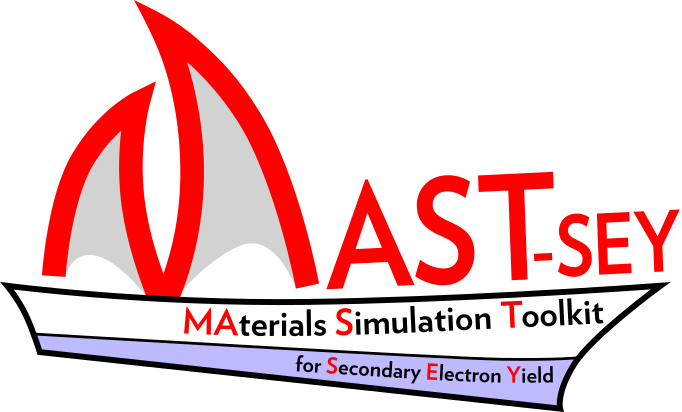

MAST-SEY is an open-source Monte Carlo code capable of predicting secondary electron emission using input data generated entirely from first principle (density functional theory) calculations. It utilises the complex dielectric function and Penn's theory for inelastic scattering processes, and relativistic Schrödinger theory by means of partial-wave expansion method to govern elastic scattering. It allows to not only use the momentum independent (q=0) dielectric function but also to include explicitly calculated momentum dependence, as well as to utilise first-principle density of states in secondary electron generation. 

## Installation

Download the source code and compile with `gcc`, version > 6.2 of `gcc` is recommended.
```bash
g++ -std=c++11 -g -O3 -o mast_sey_v25 mast_sey_v25_binary.cpp
```
1. Extract all the files to a convenient location
2. Add that location to your PATH:
```bash
export PATH=${PATH}:/complete/path/to/your/mast_sey
```    
    - you can add that line to your .bashrc of you dont want to execute it each time
3. If files are not executable make them executable:
```bash
chmod +x mast_sey_vXX mast_sey_prep elddcs
```

## Usage

```python
import foobar

foobar.pluralize('word') # returns 'words'
foobar.pluralize('goose') # returns 'geese'
foobar.singularize('phenomena') # returns 'phenomenon'
```

## Contributing
Pull requests are welcome. For major changes, please open an issue first to discuss what you would like to change.

Please make sure to update tests as appropriate.

## License
[MIT](https://choosealicense.com/licenses/mit/)
